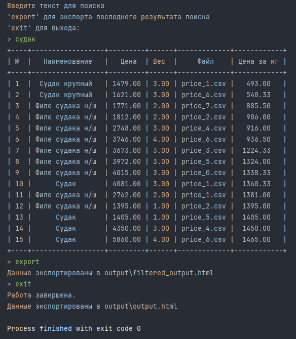
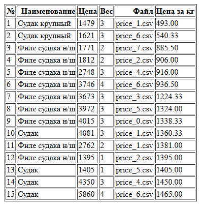
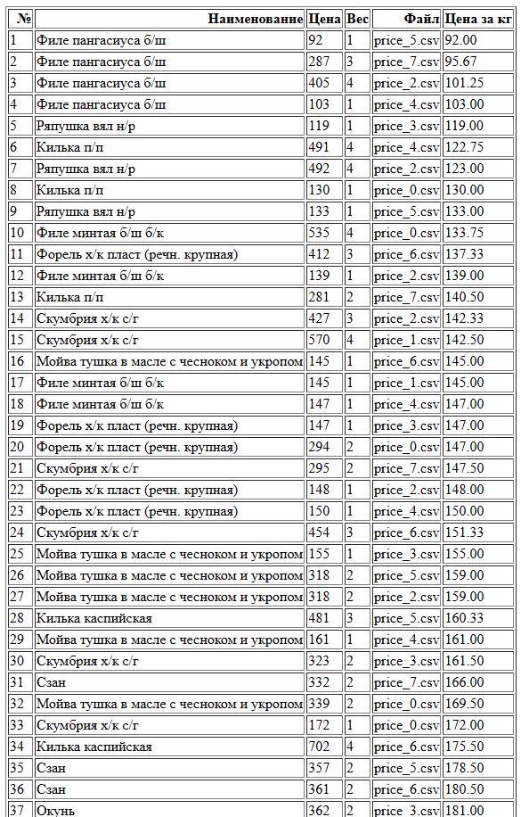

# **Анализатор прайс-листов**

---

#### Анализатор прайс-листов — это программа для анализа прайс-листов от различных поставщиков. Она загружает файлы с прайс-листами, позволяет искать товары по названию с сортировкой по цене за килограмм и экспортировать данные в HTML-файл.

---

### Основные функции:

1. **Загрузка прайс-листов**:
    - Загружаются только файлы, содержащие слово `price` в названии.
    - Поддерживается формат файлов CSV.
    - Из каждого файла извлекаются следующие столбцы:
        - Название товара: `название`, `продукт`, `товар`, `наименование`.
        - Цена: `цена`, `розница`.
        - Вес: `фасовка`, `масса`, `вес` (всегда в килограммах).
    - Автоматическое вычисление цены за килограмм.

2. **Поиск товаров**:
    - Можно искать товары по фрагменту названия (регистр текста не имеет значения).
    - Результаты поиска отображаются в виде таблицы в консоли, отсортированной по цене за килограмм.


3. **Экспорт данных**:
    - Экспортирует все данные или результаты поиска в HTML-файл.
    - В HTML-файле данные отображаются с нумерацией и заголовками на русском языке.


4. **Интерфейс консоли**:
    - Пользователь вводит текст для поиска.
    - Команда `export` экспортирует результаты последнего поиска.
    - Команда `exit` завершает работу программы и выгружает все полученные данные.

---

## Установка и запуск

### Требования

- Python 3.8+
- Установленные библиотеки:
    - `pandas`
    - `prettytable`

### Установка зависимостей

Перед запуском установите необходимые зависимости:

```bash
pip install pandas prettytable
```

### Запуск программы

Разместите файлы прайс-листов в папке `prices` (создайте её, если её нет).

Запустите программу:

```bash
python project.py
```

Введите текст для поиска, чтобы найти товары.

Используйте `export` для экспорта данных в файл `output/filtered_output.html`.

Используйте `exit` для выхода и экспорта всех данных в файл `output/output.html`.

# Примеры работы

### Пример консольного вывода:

---


---

### Пример HTML-файла (`output/filtered_output.html`):

---


---

### Пример HTML-файла (`output/output.html`):

---


---

### Особенности реализации

- Обрабатываются только файлы с `price` в названии.
- Программа устойчива к отсутствию необходимых столбцов или некорректным данным в файлах.
- Заголовки в консоли и HTML-файле на русском языке.

### Команды

- `exit:` завершает выполнение программы.
- `export:` экспортирует последние результаты поиска в HTML.
- `<текст>:` ищет товары по указанному фрагменту названия.